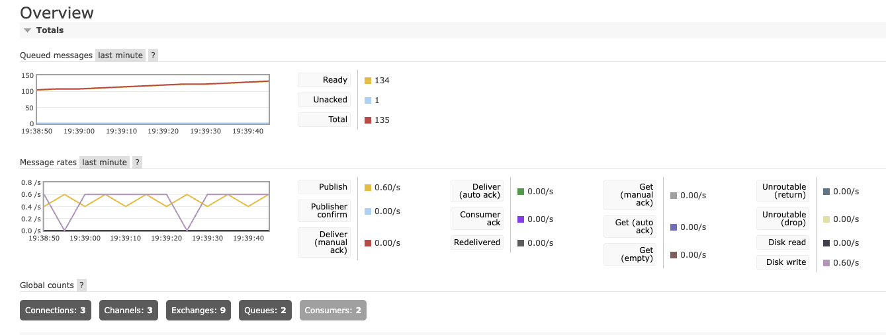
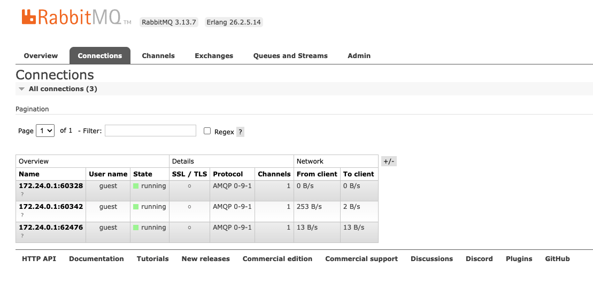
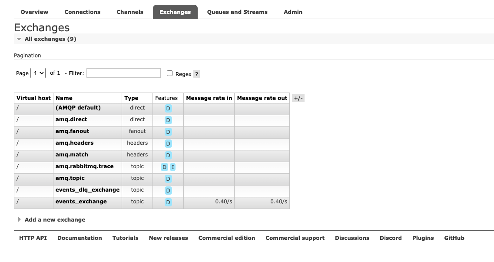
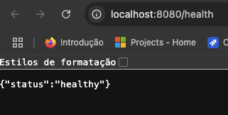
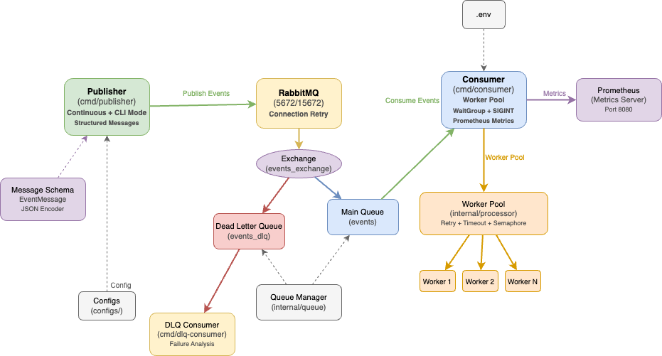
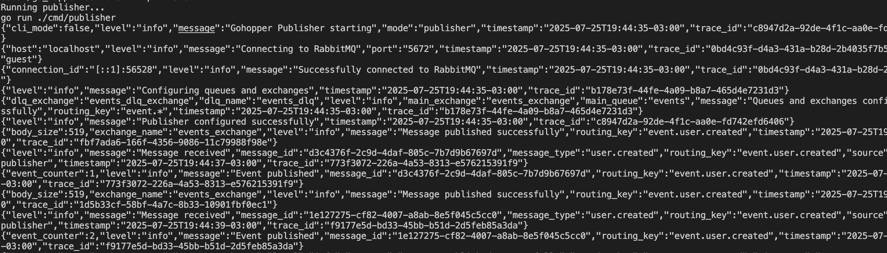
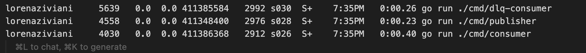

# 🐰 Gohopper - Sistema de Eventos Assíncrono

<div align="center">


<div data-badges>
  
  
  
</div>

<div data-badges>
  
  
  
  
  
  
</div>
</div>

O Gohopper é um sistema robusto de publicação e consumo de eventos assíncronos desenvolvido em Go, oferecendo uma solução completa para arquiteturas baseadas em eventos:

✔ **Processamento Concorrente** com pool de workers configurável e semáforo customizado

✔ **Controle de Falhas Avançado** com retry exponencial, backoff inteligente e Dead Letter Queue (DLQ)

✔ **Observabilidade Completa** com Prometheus metrics, logs estruturados e health checks

✔ **Race Conditions** tratadas com boas práticas de concorrência (WaitGroups, Mutex, Atomic)

✔ **Graceful Shutdown** com timeout configurável e finalização segura de goroutines

✔ **Métricas em Tempo Real** para monitoramento de performance e debugging

Desenvolvido com Go, RabbitMQ e Prometheus, o sistema garante alta performance, resiliência e observabilidade completa para ambientes de produção.

## 🖥️ Como rodar este projeto 🖥️

### Requisitos:

- [Go 1.21+](https://golang.org/doc/install) instalado
- [Docker & Docker Compose](https://docs.docker.com/get-docker/) instalado
- RabbitMQ 3.8+ (ou via Docker)

### Execução:

1. Clone este repositório:

   ```sh
   git clone https://github.com/lorenaziviani/go_hopper.git
   ```

2. Acesse o diretório do projeto:

   ```sh
   cd go_hopper
   ```

3. Instale as dependências:

   ```sh
   make deps
   ```

4. Configure as variáveis de ambiente:

   ```sh
   cp .env.example .env
   ```

   Edite o arquivo `.env` com suas configurações específicas.

5. Inicie o RabbitMQ com Docker Compose:

   ```sh
   make docker-up
   ```

6. Execute o consumer (em um terminal):

   ```sh
   make run-consumer
   ```

7. Execute o publisher (em outro terminal):

   ```sh
   make run-publisher
   ```

8. Ou simule publicação de eventos via CLI:

   ```sh
   make publish
   ```

9. Acesse os serviços:
   - **RabbitMQ Management**: [http://localhost:15672](http://localhost:15672) (guest/guest)
   - **Prometheus Metrics**: [http://localhost:8080/metrics](http://localhost:8080/metrics)
   - **Health Check**: [http://localhost:8080/health](http://localhost:8080/health)
   - **Dashboard**: [http://localhost:8080/](http://localhost:8080/)

## 🗒️ Features do projeto 🗒️

🚀 **Performance & Concorrência**

- **Worker Pool**
  - Processamento paralelo com múltiplas goroutines
  - Pool configurável via parâmetro `-workers`
  - Semáforo customizado para controle de concorrência
  - Graceful shutdown com finalização de jobs em andamento
- **Race Conditions**
  - Tratamento adequado com Mutex, WaitGroups e Atomic
  - Implementação thread-safe para métricas concorrentes
  - Sincronização de goroutines com boas práticas
- **Canais & Goroutines**
  - Comunicação entre goroutines de forma thread-safe
  - Context cancellation para controle de vida
  - WaitGroups para sincronização de finalização

🔄 **Resiliência & Controle de Falhas**

- **Retry com Exponential Backoff**
  - Tentativas automáticas com delay crescente
  - Jitter para evitar thundering herd
  - Configuração flexível de max retries e timeouts
  - Context timeout para cada tentativa
- **Dead Letter Queue (DLQ)**
  - Redirecionamento automático de mensagens falhadas
  - Separação por tipo de falha (retryable/non-retryable)
  - Consumer específico para processamento de DLQ
  - Metadados detalhados para análise de falhas
- **Graceful Shutdown**
  - Captura de sinais SIGINT/SIGTERM
  - Timeout configurável para finalização
  - Finalização segura de todas as goroutines
  - Logs detalhados do processo de shutdown

📊 **Observabilidade & Monitoramento**

- **Prometheus Metrics**
  - Métricas de mensagens processadas/falhadas
  - Histograma de duração de processamento
  - Contadores de retry attempts
  - Gauges de workers ativos e tamanho da fila
- **Structured Logging**
  - Logs JSON estruturados com trace_id
  - Múltiplos níveis (debug, info, warn, error, fatal)
  - Contexto rico para análise e debugging
  - Metadados detalhados em cada log
- **Health Checks**
  - Endpoint de health check em tempo real
  - Verificação de conectividade com RabbitMQ
  - Status do worker pool e métricas
  - Dashboard web com links úteis

🛠️ **Administração & Testes**

- **Comandos Makefile**
  - Scripts automatizados para build, run e test
  - Comandos específicos para consumer e publisher
  - Testes de integração e unitários
  - Linting e formatação de código
- **Testing Suite**
  - Testes de race conditions e concorrência
  - Testes de métricas com diferentes implementações
  - Testes de integração publisher/consumer
  - Benchmarks de performance
- **Docker Integration**
  - Containerização do RabbitMQ
  - Docker Compose para ambiente completo
  - Health checks para serviços

## 🔧 Comandos de Teste 🔧

```bash
# Rodar todos os testes
make test

# Testes específicos
make test-coverage    # Testes com coverage
make lint             # Linting do código
make format           # Formatação do código

# Comandos de métricas
make dashboard        # Dashboard completo
make dashboard-live   # Dashboard em tempo real
make metrics          # Métricas Prometheus
make health           # Health check

# Ver todos os comandos disponíveis
make help
```

## 📈 Monitoramento e Dashboards 📈

### RabbitMQ Management UI

Acesse [http://localhost:15672](http://localhost:15672) com **guest/guest** para ver:

- Overview das filas e exchanges
- Conexões ativas e consumers
- Métricas de throughput e latência
- Status de health dos serviços







### Prometheus Metrics

Acesse [http://localhost:8080/metrics](http://localhost:8080/metrics) para monitorar:

- Métricas em tempo real do sistema
- Contadores de mensagens processadas/falhadas
- Histograma de duração de processamento
- Status de workers e filas


### Dashboard de Métricas

Acesse [http://localhost:8080/](http://localhost:8080/) para visualizar:

- Health check em tempo real
- Links para métricas e monitoramento
- Status do sistema



## 🌐 Endpoints da API 🌐

### Health Check

```bash
# Health Check
GET /health
Response: {"status":"healthy"}

# Métricas Prometheus
GET /metrics
Response: # HELP messages_processed_total...

# Dashboard
GET /
Response: HTML com links úteis
```

### Consumer Endpoints

```bash
# Consumer com workers padrão (5)
make run-consumer

# Consumer com workers customizados
make run-consumer-workers

# Consumer com tag customizada
make run-consumer-tag

# DLQ Consumer
make run-dlq-consumer
```

### Publisher Endpoints

```bash
# Publisher contínuo
make run-publisher

# Publisher CLI (teste)
make publish
```

## 🏗️ Arquitetura do Sistema 🏗️

<div align="center">

</div>

```
Publisher → RabbitMQ Exchange → Queue → Consumer → Worker Pool → Processor → DLQ (se falhar)
```

**Fluxo detalhado:**

1. **Publisher**: Publica eventos na exchange RabbitMQ
2. **Exchange**: Roteia mensagens para filas baseado no routing key
3. **Queue**: Armazena mensagens aguardando processamento
4. **Consumer**: Consome mensagens com worker do pool
5. **Worker Pool**: Processa mensagens concorrentemente
6. **Processor**: Aplica retry e redireciona para DLQ se necessário
7. **DLQ**: Armazena mensagens que falharam após max retries

## 📊 Estrutura do Evento 📊

```json
{
  "id": "550e8400-e29b-41d4-a716-446655440000",
  "type": "user.created",
  "data": {
    "user_id": "user-1",
    "email": "user1@example.com",
    "name": "User 1",
    "timestamp": 1704067200,
    "event_data": "User data for event 1"
  },
  "metadata": {
    "priority": 1,
    "retry_count": 0,
    "headers": {
      "test_mode": true,
      "continuous_mode": false
    },
    "tags": ["test", "cli", "user"]
  },
  "timestamp": "2024-01-01T12:00:00Z",
  "source": "gohopper-publisher",
  "version": "1.0.0",
  "trace_id": "550e8400-e29b-41d4-a716-446655440001",
  "correlation_id": ""
}
```

### Tipos de Eventos Suportados

- `user.created` - Criação de usuário
- `user.updated` - Atualização de usuário
- `order.created` - Criação de pedido
- `payment.processed` - Processamento de pagamento
- `notification.sent` - Envio de notificação

## 🔄 Fluxo de Processamento 🔄

### 1. Publicação de Eventos

```bash
# Modo contínuo
make run-publisher

# Modo CLI (teste)
make publish
```

### 2. Consumo e Processamento

```bash
# Iniciar consumer
make run-consumer

# Ver logs em tempo real
# Os logs mostram o processamento das mensagens
```

### 3. Monitoramento

```bash
# Dashboard em tempo real
make dashboard-live

# Métricas específicas
make metrics-json
```

## 📈 Performance e Métricas 📈

### Métricas Disponíveis

| Métrica                       | Tipo      | Descrição                       |
| ----------------------------- | --------- | ------------------------------- |
| `messages_processed_total`    | Counter   | Total de mensagens processadas  |
| `messages_failed_total`       | Counter   | Total de mensagens que falharam |
| `retry_attempts_total`        | Counter   | Total de tentativas de retry    |
| `processing_duration_seconds` | Histogram | Duração do processamento        |
| `active_workers`              | Gauge     | Número de workers ativos        |
| `queue_size`                  | Gauge     | Tamanho da fila                 |

### Exemplo de Performance





## 🧪 Testes e Qualidade 🧪

### Testes Disponíveis

```bash
# Testes unitários
go test ./internal/processor
go test ./internal/queue

# Testes de integração
go test ./tests/integration

# Testes com coverage
make test-coverage

# Linting
make lint
```

### Cobertura de Testes

- **Testes de Race Conditions**: Verificação de concorrência
- **Testes de Métricas**: Validação de contadores thread-safe
- **Testes de Integração**: Publisher/Consumer end-to-end
- **Testes de Performance**: Benchmarks e stress tests

## 💎 Links úteis 💎

- [Go Documentation](https://golang.org/doc/)
- [RabbitMQ Documentation](https://www.rabbitmq.com/documentation.html)
- [Prometheus](https://prometheus.io/docs/)
- [Docker Documentation](https://docs.docker.com/)
- [Concurrency in Go](https://golang.org/doc/effective_go.html#concurrency)
- [Go Testing](https://golang.org/pkg/testing/)
